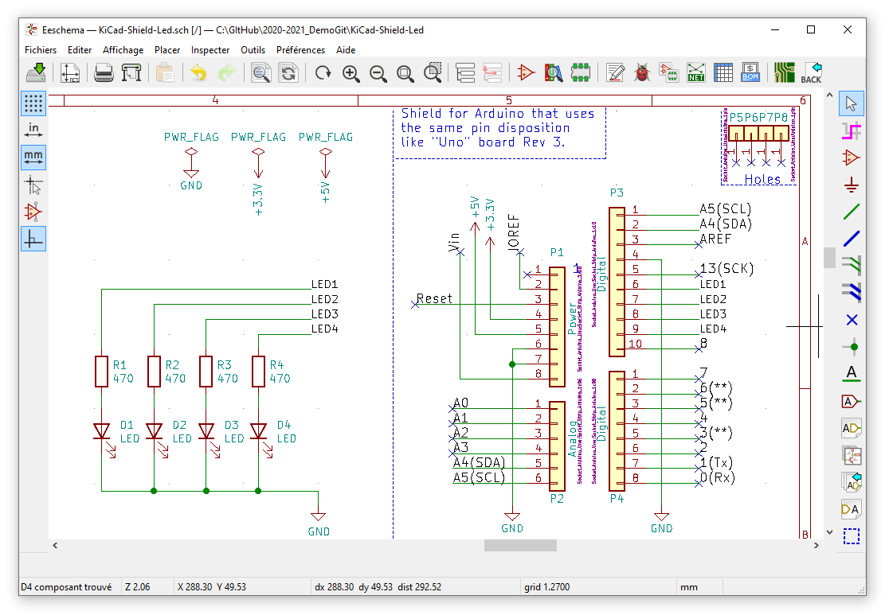
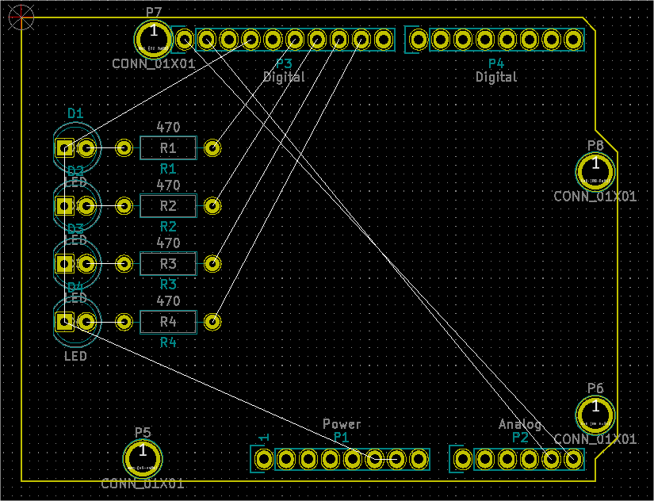
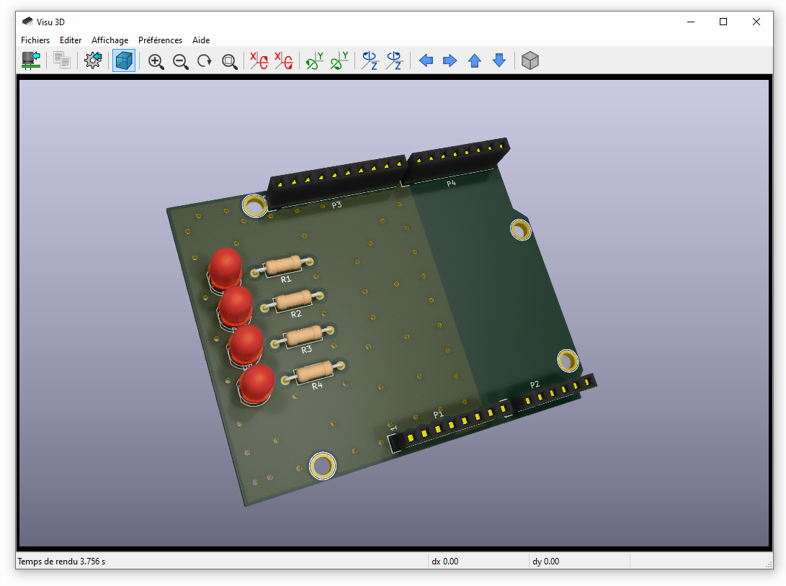
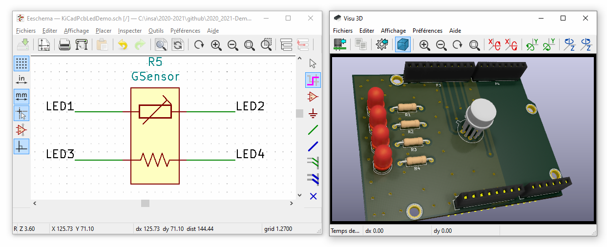

# 2020_2021-Demo4all

My Project Shield Arduino

Contact : [ArnauldDev](biganzol@insa-toulouse.fr)

- [x] Ajouter de nouveaux fichiers
- [x] Les ajouter à l'index de suivi
- [x] Faire un commit (en local sur mon PC)
- [x] Pousser le ou les commit vers le serveur
- [x] Créer une nouvelle branche
- [x] Basculer sur cette branche

---

## 2020_2021-Demo4all

### Arduino Project

ArduinoSerialEventDemo

```C++
// print the string when a newline arrives:
if (stringComplete)
{
    Serial.println(); // faire un saut de ligne entre les réponses
    Serial.print("Vous avez repondu ");
    Serial.println(inputString);
    // test de la réponse du joueur
    if (inputString == "kicad")
    {
        Serial.println("Go for a new PCB board!");
    }
    else
    {
        Serial.println("C'est pas tout a fait ca...");
    }
    // clear the string:
    inputString = "";
    stringComplete = false;
}
```

### KiCad - Shield for Arduino

#### TODO Concevoir une carte avec KiCad

- [x] Créer un projet de PCB pour réaliser une shield Arduino
- [x] Saisi du schéma
- [x] Vérification des tests électriques **ERC**
- [x] Association des empreintes de composants avec leur boitier
- [x] Génération de la netlist
- [x] Conception de la carte électronique
- [x] Importation de la netlist
- [x] Placement des composants
- [x] Définir les contraintes de conception de la carte électronique ([stackup](https://www.emsproto.com/fr/standard-multi-layer-pcb-stackup))
- [x] Router les pistes de la carte électronique

#### KiCad Tools used

[KiCad EDA - Schematic Capture & PCB Design Software](https://kicad-pcb.org/), version: 5.1.8

Open source EDA / electronics CAD software for Windows, macOS and Linux.

#### Librairies de composants

* LED_THT:LED_D5.0mm
* Resistor_THT:R_Axial_DIN0207_L6.3mm_D2.5mm_P10.16mm_Horizontal

Lien vers les librairies officielles

https://gitlab.com/kicad/libraries

##### Créer de nouveaux composants

Avec un schéma :

\library
*.dcm
*.lib

Et une empreinte :

\Footprints\MyPackage.pretty
-.kicad_mod

#### Electrical diagram



## PCB

| Component placement                                 | Routage                                    |
| --------------------------------------------------- | ------------------------------------------ |
|  |  |

<!--  -->

<!--  -->

### Vue 3D


